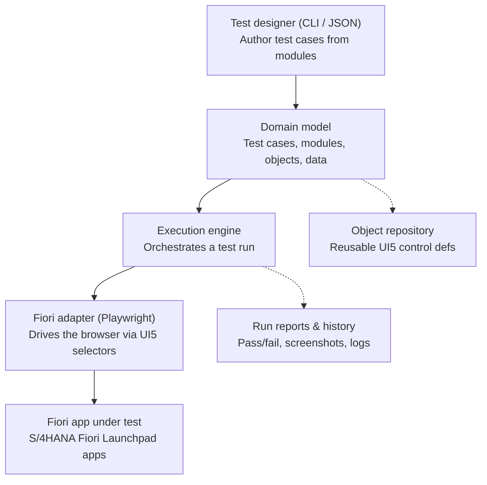

# Project Brief: SAP S/4HANA Test Automation Platform

## Role & Working Style

You are acting as the lead architect and engineer for a new software product. This is a
multi-month effort, not a single-session build. Before writing any code:

1. Ask me clarifying questions about anything below marked **[NEEDS DECISION]**.
2. Propose a high-level architecture and a phased roadmap (MVP → v1 → v2).
3. Get my sign-off on the architecture and phase 1 scope before scaffolding the repo.
4. Then work phase by phase — plan a phase, implement it, let me review, move on.

Do not attempt to build the whole system in one shot. Favor a working, testable
walking skeleton over a large amount of unreviewed code.

Important IP note: build an **original** tool with equivalent capabilities to
commercial tools like Tricentis Tosca. Do not copy Tosca's source code, UI, trademarks,
proprietary file formats, or marketing language — only replicate the general
*category of capability* (model-based, scriptless test automation) using our own
design and naming.

---

## 1. Product Goal

Build a test automation platform for SAP S/4HANA that lets QA engineers (not just
developers) design, maintain, and execute end-to-end business process tests with
minimal scripting, similar in spirit to Tricentis Tosca's model-based approach:

- **Object identification**: scan SAP screens and build a reusable repository of UI
  controls/objects, decoupled from individual test cases.
- **Scriptless test design**: testers compose test cases from reusable modules/steps
  (e.g., "Create Sales Order", "Enter Customer") rather than writing code per test.
- **Data-driven execution**: separate test logic from test data.
- **Execution engine**: run tests against real SAP systems and report pass/fail with
  evidence (screenshots, logs).
- **Maintainability**: when a screen changes, testers fix the object definition once,
  not every test case that uses it.

## 2. Target Systems — SAP S/4HANA Has Two Distinct UI Technologies

The tool must handle both, likely via different automation adapters under a common
abstraction:

| UI Technology | Description | Automation approach |
|---|---|---|
| **SAP GUI (classic Dynpro)** | Older transactions (e.g., VA01, ME21N) via SAP GUI for Windows | SAP GUI Scripting API (COM-based on Windows) |
| **Fiori / SAPUI5 apps** | Modern web apps, Fiori Launchpad | Browser automation (Playwright/Selenium) with UI5-aware selectors (control IDs, not brittle CSS/XPath) |

**Decision: Phase 1 focus is Fiori/UI5.** Classic SAP GUI (Dynpro) support is
explicitly deferred to a later phase. The adapter layer (see Section 4) must still be
designed so a SAP GUI Scripting adapter can be added later without reworking the
core engine or domain model.

Still to decide before scaffolding:
- **[NEEDS DECISION]** Should Phase 1 also drive things through APIs (OData services,
  BAPIs/RFC) for setup/teardown of test data, in addition to UI-driven testing? (Useful
  for creating clean test preconditions without UI steps, but adds scope — can be
  deferred to Phase 2.)
- **[NEEDS DECISION]** Which specific Fiori app(s) should the walking-skeleton test
  target first? Pick something simple and stable (e.g. a single Fiori Elements list
  report / object page app) rather than a complex custom UI5 app, so the first
  end-to-end test proves the architecture without fighting app-specific quirks.

## 3. Core Capabilities (Feature Backlog)

### Must-have for MVP
- Object repository: scan a screen and capture controls (SAP GUI: id, type, text,
  window/screen context; Fiori: UI5 control id/type/binding path/properties).
- Module/component library: named, reusable, parameterized action blocks (e.g.
  "Login", "Navigate to Transaction", "Enter field value") built from repository
  objects.
- Test case composer: build a test case as an ordered sequence of modules with
  parameter values (initially can be a structured file/JSON or simple UI — defer
  fancy drag-and-drop UI to a later phase).
- Test data management: external data sheets/tables bound to test case parameters,
  enabling data-driven runs.
- Execution engine: run a test case end-to-end against a live system, capture
  step-by-step results, screenshots on failure, and timing.
- Reporting: pass/fail summary per test case/step, exportable (HTML/JSON at minimum).
- Basic CLI or API to trigger test runs (for CI/CD integration later).

### Later phases
- Visual/no-code test case designer (drag-and-drop UI).
- Risk-based test case prioritization.
- Requirements traceability (link test cases to requirements/user stories).
- Self-healing object identification (fuzzy matching when UI changes slightly).
- Parallel/distributed execution across multiple SAP clients or environments.
- Integration with ALM/test management tools (e.g., Jira, Azure DevOps) and CI/CD.
- Role-based access control, audit trail, multi-user collaboration.
- Reusable "business process" templates spanning multiple S/4HANA modules
  (O2C, P2P, etc.).

## 4. Phase 1 Architecture (Fiori-focused)

Propose (and refine with me) a layered architecture along these lines. The pipeline
runs top to bottom; the object repository and reporting store sit alongside as
supporting stores that the pipeline reads from and writes to.

Notes on this diagram:
- **Solid arrows** = the main execution pipeline (design → model → engine → adapter →
  live app).
- **Dashed arrows** = supporting reads/writes to persisted stores (object repository,
  run history) that aren't part of the linear flow.
- The **Fiori adapter** is the only box that changes if we later add SAP GUI support —
  it should implement a common adapter interface (e.g. `findObject`, `performAction`,
  `readValue`, `waitFor`) so the execution engine never needs to know which UI
  technology it's talking to. A future `SapGuiAdapter` would implement the same
  interface using SAP GUI Scripting/COM instead of Playwright.
- The **object repository** stores UI5 control definitions (control id, type, binding
  path, relevant properties) — captured once per screen/app, reused across many test
  cases and modules.

Design the adapter layer so new UI technologies (SAP GUI, mobile, etc.) can be added
later without touching the core engine or domain model.

## 5. Technology Stack — Propose Options, Then Recommend

Please research and propose options for:
- **Language/runtime** for the core engine (e.g., TypeScript/Node.js, Python). Since
  Phase 1 targets Fiori only, we're **not** constrained by SAP GUI Scripting's
  COM/Windows dependency yet — pick whatever gives the cleanest Playwright integration
  and the best fit for a pluggable adapter interface (Node/TypeScript pairs naturally
  with Playwright; keep in mind that Phase 2's SAP GUI adapter will likely want
  Windows + COM, e.g. via a `.NET`/`pywin32` sidecar process if the core stays
  cross-platform).
- **Fiori/UI5 automation**: Playwright is the default choice for Phase 1. Investigate
  whether UI5 exposes stable control IDs (e.g. via `data-sap-ui` attributes) we can
  rely on for object identification, rather than brittle generated CSS classes.
- **Storage**: what's proportionate for MVP (SQLite/Postgres) vs. later scale.
- **Reporting UI**: static HTML report vs. a small web dashboard.
- **Packaging**: how this gets distributed/run (desktop app, server + web UI, CLI
  tool, etc.) — depends on who the end users are (testers on Windows machines with
  SAP GUI installed, most likely).

**[NEEDS DECISION]** Who are the primary users, and what's their environment? (e.g.,
QA engineers with SAP GUI installed locally on Windows laptops, running tests
individually vs. a central server executing tests headlessly.)

## 6. Non-Functional Requirements to Keep in Mind

- **Reliability**: SAP screens can be slow to load — the engine needs robust
  wait/retry logic, not fixed sleeps.
- **Traceability**: every run should produce enough evidence (logs/screenshots) to
  debug a failure without re-running.
- **Extensibility**: adding a new module/object type shouldn't require core changes.
- **Security**: SAP credentials and connection details must never be stored in plain
  text; support secure credential storage.
- **Licensing**: confirm SAP GUI Scripting is enabled/permitted in the target
  landscape (it's sometimes disabled by SAP Basis teams for security reasons) —
  flag this as an early risk to validate with the client's Basis team.

## 7. What I Want From You Right Now

1. Ask me the **[NEEDS DECISION]** questions above (and any others you think are
   necessary) before proposing an architecture.
2. Once scope is clear, propose:
   - A phased roadmap (Phase 1 = walking skeleton for one UI technology, one simple
     transaction/app, end-to-end).
   - A concrete tech stack recommendation with brief justification.
   - A repo structure.
3. Wait for my approval, then scaffold Phase 1 only.
