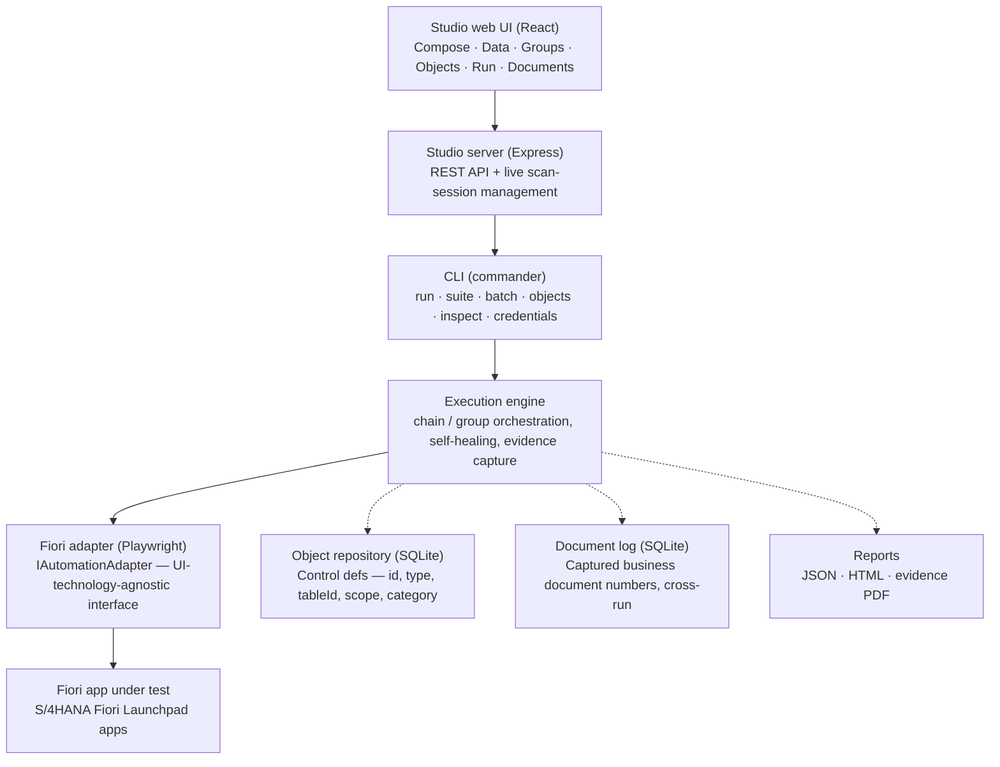

# Project Brief v2.0: SAP S/4HANA Test Automation Platform ("Studio")

> Supersedes the original kickoff brief, which is preserved unchanged at
> `PROJECT_BRIEF.md`. That version was written prospectively, before any code
> existed, and is kept as a historical record of the original ask. This
> version documents what was actually designed, built, and validated against
> a live SAP S/4HANA Cloud tenant since then — decisions that were open
> questions in v1.0 are now resolved facts, "later phase" items that already
> shipped are marked as such, and capabilities that emerged during
> implementation (and weren't anticipated at all) are documented as new
> sections.

---

## 1. Status at a Glance

| Area | v1.0 ask | Status |
|---|---|---|
| Object repository | MVP | ✅ Delivered, substantially exceeded |
| Module/component library | MVP | ✅ Delivered — 21 modules |
| Test case composer | MVP (JSON/simple UI; visual UI deferred) | ✅ Delivered — full visual UI, ahead of schedule |
| Test data management | MVP | ✅ Delivered |
| Execution engine | MVP | ✅ Delivered, exceeded (3 run modes) |
| Reporting | MVP | ✅ Delivered, exceeded (4 output forms) |
| CLI/API to trigger runs | MVP | ✅ Delivered |
| Visual/no-code designer | Later phase | ✅ Delivered early |
| Self-healing object identification | Later phase | ✅ Delivered early |
| Reusable business-process templates (P2P etc.) | Later phase | ✅ Delivered early — full P2P chain |
| SAP GUI (classic Dynpro) adapter | Deferred (by design) | ⏸ Still deferred — adapter interface ready for it |
| Risk-based prioritization | Later phase | ⏹ Not started |
| Requirements traceability | Later phase | ⏹ Not started |
| Parallel/distributed execution | Later phase | ⏹ Not started |
| ALM/CI tool integration | Later phase | ⏹ Not started |
| Audit trail | Later phase | ✅ Delivered early — append-only `RunHistoryStore` (BL-12/13) |
| RBAC, multi-user | Later phase | ⏹ Not started |

---

## 2. Product Goal — Confirmed, Unchanged

The goal stated in v1.0 stands and has been validated in practice, not just designed:
QA engineers can scan a real Fiori screen, curate a repository of controls with no
code, compose a test case from reusable modules, attach data, and execute it —
watching it run live against a real tenant, with the resulting evidence and captured
business document numbers (PO/Material Document/Invoice numbers) durably logged.

The "when a screen changes, fix the object definition once" principle has been
exercised for real: a stale control id was healed automatically mid-run via
suffix-matching against the live UI5 control registry, without editing any test case.

## 3. Target Systems — Decision Confirmed

**Fiori/UI5 only, as decided in v1.0.** SAP GUI (classic Dynpro) remains explicitly
out of scope. The adapter layer (`IAutomationAdapter` in `packages/engine/src/adapter.ts`)
is a clean, UI-technology-agnostic interface — `open`, `navigate`, `waitFor`,
`performAction`, `readValue`, `clickByText`, `apiGet`/`apiDelete`, evidence capture —
that a future `SapGuiAdapter` could implement without any change to the engine,
modules, or domain model. This was a design goal in v1.0 and remains true today,
though no SAP GUI work has started.

**The two v1.0 [NEEDS DECISION] items are now resolved:**
- *APIs for setup/teardown*: partially yes. OData GET is used for read-only
  master-data queries (`QueryValidLineItemData` — pulls real valid material/plant
  combinations from the live tenant rather than hardcoding test data that might not
  exist) and OData DELETE for draft cleanup (`CleanupAbandonedDrafts`). Full
  BAPI/RFC-based setup/teardown was not pursued — the OData pattern proved
  sufficient for what's needed so far.
- *First Fiori app*: **Manage Purchase Orders** (Fiori Elements List Report /
  Object Page) — the exact shape v1.0 recommended ("a single Fiori Elements list
  report / object page app rather than a complex custom UI5 app").

## 4. Core Capabilities — Detailed Status

### Object repository
Originally scoped as "scan a screen and capture controls." Delivered as two
complementary capture modes:
- **Bulk scan**: enumerate every UI5 control on a screen, classified into
  `actionable` / `informational` / `structural` categories to cut noise (a raw
  scan of one screen returned 586 controls before this classification existed).
- **Interactive picking**: Ctrl+Click any control in a live, visible browser
  window to add it to the repository by name — continuous (pick several controls
  in a row without re-arming), with ancestor-preference resolution (clicking a
  tile's icon correctly resolves to "the tile," not the icon).
- **Table awareness**: a table's Column (not its per-row cells, which render
  unstable "clone" ids) is captured once; row-indexed access at runtime is a
  separate, already-solved concern (see Execution engine below).
- **Self-healing**: if a stored control id goes stale (a Fiori Elements view-id
  prefix regenerates), the adapter fuzzy-matches by id suffix + UI5 type and
  persists the fix back to the repository automatically.
- **Scope tagging**: controls are tagged `shell` (Fiori Launchpad chrome, shared
  across every app) vs `app` (screen-specific), so shell objects captured once are
  recognized everywhere.

### Module/component library
21 modules in `packages/engine/src/modules/`, spanning two tiers:
- **Generic, reusable across any screen**: `Login`, `NavigateToApp`,
  `OpenAppFromCatalog`, `ClickButton`, `ClickByText`, `EnterHeaderField`, `Wait`,
  `AssertControlText`, `DismissDialogIfPresent`.
- **Business-process-specific**: `AddLineItem`, `SaveAndCaptureDocumentNumber`,
  `CaptureDocumentNumberFromSuccessDialog`, `CleanupAbandonedDrafts`,
  `SearchGoodsReceiptByPO`, `AssignPurchaseOrderItems`, `SelectStorageLocation`,
  `ReceiveOpenLineItem`, `MatchGrossAmountToPoReference`, `SimulateInvoice`,
  `DismissInvoiceDialogs`, `QueryValidLineItemData`.

### Test case composer
v1.0 explicitly deferred a visual/drag-and-drop UI to a later phase, expecting a
structured JSON file or simple UI for the MVP. What's live today in Studio's
**Compose** tab:
- A visual step builder — add/edit/remove steps through forms, not hand-written JSON.
- Drag-and-drop step reordering.
- Inline editing — the edit form expands directly beneath the step being edited.
- A dedicated repeating-row editor for multi-line-item modules (`AddLineItem`),
  hiding the underlying `;`-delimited parameter convention behind a real table UI.
- Datalist autocomplete suggesting valid object-repository names per field, scoped
  to whichever App ID the step is set to.

### Test data management
CSV-backed data files (Studio's **Data** tab), with `${placeholder}` resolution
against a data row at run time — or a literal hardcoded value where no data-driving
is needed. Values are resolved from the data row first, then from `runState`
(values captured earlier in the same run), so a step can reference a document
number a prior step just captured.

### Execution engine
Three run modes, not one:
- **Chain**: one shared browser session across dependent test cases —
  later steps can reference values earlier ones captured.
- **Suite**: independent test cases, each its own fresh session; one failing
  doesn't stop the rest.
- **Batch**: independent named **Groups** (a saved, named chain with its own App
  ID and data file) — a group failing doesn't stop other groups.

### Reporting
Four output forms, not one: JSON report, HTML report, an annotated evidence PDF
(screenshots captioned "field = value" for every fill), and a permanent
cross-run **Document Log** — every business document number any capture module
has ever produced (PO, Material Document, Supplier Invoice numbers), searchable
by App ID or key, outliving the individual run's own report.

### CLI / API to trigger runs
The CLI (`taf run` / `taf suite` / `taf batch`) is the actual execution path in
every case — Studio's web UI doesn't reimplement execution, it spawns the same
CLI as a child process and polls its output. This means anything that works from
Studio also works headlessly from a CI pipeline, and vice versa, by construction
rather than by parallel maintenance.

## 5. Later-Phase Backlog — Delivered Early vs. Still Open

**Delivered well ahead of the phase they were scoped for:**
- Visual/no-code test case designer (Compose tab).
- Self-healing object identification (id-suffix + type-confirmed fuzzy match).
- Reusable business-process templates spanning modules: a full **Procure-to-Pay**
  chain exists as a Group (`testgroups/po-gr-invoice.json`) — Create Purchase Order
  → Post Goods Receipt → Post Supplier Invoice, including 3-way-match support
  (`MatchGrossAmountToPoReference`) and negative-path coverage
  (`create-po-missing-item-negative.json` asserts a Save is correctly blocked
  when a required line item is missing).

**Still open, as originally expected at this stage:**
- Risk-based test case prioritization.
- Requirements traceability (linking test cases to Jira/ADO work items).
- Parallel/distributed execution across multiple SAP clients or environments —
  batch mode runs Groups sequentially today, not concurrently.
- ALM/CI tool integration beyond the CLI itself (no direct Jira/Azure DevOps
  connector).
- Role-based access control, audit trail, multi-user collaboration — Studio is
  a single-user local tool today.
- SAP GUI (classic Dynpro) adapter — deliberately still deferred.

## 6. Architecture — As Built

Notes:
- The CLI is the single real execution path; Studio's server never talks to the
  browser directly — it spawns the CLI and reads its JSON reports back. This was
  a deliberate choice to avoid maintaining two execution implementations.
- The interactive scan session (`packages/studio-server/src/scanSession.ts`) is
  the one architectural exception: it holds a live, visible Playwright browser
  across multiple HTTP requests (open → capture/pick → close), because unlike
  every other Studio feature, object capture needs a human driving navigation in
  real time, not a spawn-and-run-to-completion process.
- `IAutomationAdapter` is unchanged in spirit from the v1.0 architecture note — a
  future `SapGuiAdapter` remains a drop-in, not a rework.

## 6a. Execution Modes — Chain vs. Suite vs. Batch

Three run modes exist because they address three different business situations,
not three levels of the same thing:

| Mode | Session | Data-row looping | Business case |
|---|---|---|---|
| **Chain** | One shared session across all test cases | Every row — each row is one full pass through the whole chain, stages sharing `runState` (e.g. a PO number flows from Create PO into Post Goods Receipt into Post Supplier Invoice) | A dependent, multi-stage business process, repeated per transaction |
| **Suite** | Fresh session per test case | Every row × every test case | A set of independent scenarios/variations that shouldn't affect each other (a regression pack: happy path, negative path, edge cases) |
| **Batch** | Fresh session per Group | Only the first row of each Group's data file | Multiple independent, *named* business scenarios run together as one operational cycle |

Batch's first-row-only behavior is intentional, not a limitation to fix by
default: the existing convention for "the same Group with different data" is
already to author another named Group file (`PO-GR-INVOICE-1.json` and
`PO-GR-INVOICE-2.json` both exist for exactly this reason) — each representing
one canonical scenario, not a data sweep. Chain/Suite already own the
data-sweep job. Recommendation: leave as-is unless a concrete case shows up
that this doesn't cover.

## 6b. Two Distinct Workloads — Why Cloud Migration Isn't One Move

Studio is really two different kinds of work wearing one UI:

- **Interactive object capture** — a human needs to see a real browser and
  Ctrl+Click controls in real time. Inherently tied to wherever that human is
  sitting.
- **Headless execution** — composed test cases running unattended (CLI runs,
  reporting, the object repository, the document log, and the audit ledger).
  Nothing about this needs a human watching, and it already works headless
  today.

This split is why the cloud roadmap (Section 11) has separate tracks: the
headless-execution side can move to the cloud with comparatively little new
engineering, while cloud-hosting the *capture* experience needs either a small
local companion process on each engineer's machine (Track 2) or a
video-streamed remote browser (a materially bigger undertaking, not currently
planned) — treating both as the same problem was the mistake to avoid.

## 7. Technology Stack — As Built

| Question (v1.0) | Decision |
|---|---|
| Language/runtime | TypeScript / Node.js, as anticipated |
| Fiori/UI5 automation | Playwright, driving via UI5 control ids (`sap.ui.getCore().byId()`), not CSS/XPath — confirmed stable |
| Storage | SQLite (`better-sqlite3`) for both the object repository and the document log — proportionate for current scale |
| Reporting UI | **Both** — static HTML/JSON/PDF reports *and* a small web dashboard (Studio), not one instead of the other |
| Packaging | CLI + a locally-run web server (`taf studio`), driven by a QA engineer on their own machine — self-hosted, not a hosted SaaS product |
| Primary users | Confirmed: QA engineers on Windows machines, driving a real, visible browser themselves during object capture and (optionally) during execution |
| Credential security | `keytar` — OS-native credential store (Windows Credential Manager, etc.); env vars as a CI-only fallback. Never plain text. |

## 8. Capabilities Not Anticipated in v1.0

These emerged from hands-on use against a real tenant, not from upfront design:

- **Interactive "pick a control" capture** — the original brief only described
  scanning; clicking individual controls in a live window to build the
  repository turned out to be essential once bulk scans proved too noisy to be
  usable directly.
- **Grid-table row virtualization handling** — `sap.ui.table.Table` only renders
  a fixed pool of DOM row slots and recycles them; a naive row-index selector
  silently read the wrong row once a table had more items than fit on screen.
  Fixed by resolving which rendered slot currently holds the requested absolute
  row before building the cell selector.
- **UI5 control classification heuristics** — deciding what's "worth a tester's
  attention" (actionable/informational) vs. structural noise, including handling
  view/component-hosting wrapper controls (`ComponentContainer`, `XMLView`) that
  otherwise get miscategorized as informational purely from inheriting a page's
  binding context.
- **Document Log** — a durable, cross-run store for captured business document
  numbers, distinct from any single run's own report.
- **Data-driven object queries** (`QueryValidLineItemData`) — pulling real valid
  master data from the live tenant via OData before a run, rather than
  hardcoding test data that may not exist in a given environment.
- **Negative-path test cases** as a first-class pattern, not an afterthought.

## 9. Non-Functional Requirements — Status

| Requirement (v1.0) | Status |
|---|---|
| Reliability (no fixed sleeps) | Retry/poll-based waits throughout; timeouts tuned from real tenant latency (SAP Cloud login/navigation observed at 20-65s) |
| Traceability | JSON/HTML reports, evidence PDF, and the Document Log together give enough to debug a failure without re-running |
| Extensibility | New modules/object types are additive — no core engine changes needed to add one |
| Security | Credentials via OS-native secure storage; never plain text |
| Licensing (SAP GUI Scripting) | Not yet relevant — Phase 1 remains Fiori-only |

## 10. Backlog — Traceable to Product Feedback

Every item below traces back to a specific point raised during a hands-on walkthrough
of the product (numbered Q1-Q20 in the working notes). Nothing on that list is
dropped — items that don't need engineering work (e.g. Q3, Q15) are resolved by
documentation instead of code, and are marked as such rather than omitted.

**Status legend:** ⏹ Not started · 🔶 Recommended, awaiting go-ahead · ✅ Done

### Phase 1 — Foundational clarity & correctness (no open decisions)

| ID | Source | Item | Status |
|---|---|---|---|
| BL-01 | Q14 | Reorder Studio's tabs to match actual workflow: Objects → Compose → Data → Groups → Run → Documents | ✅ |
| BL-02 | Q9 | Fix Control Name field — currently can't be changed once a value is chosen | ✅ |
| BL-03 | Q8 | Filter object suggestions by the control "kind" a module's param expects (e.g. `Click Button`'s control name should only suggest clickable objects, not table columns) | ✅ |
| BL-04 | Q5 | Parameterize `AddLineItem` and `SaveAndCaptureDocumentNumber` so object names are passed as params (like `ClickButton`/`EnterHeaderField` already do) instead of hardcoded — the reason they can't yet drive anything but a Purchase Order | ✅ — `AddLineItem` went further: its columns are now fully dynamic (any table, not just PO-shaped), not just its object names |
| BL-05 | Q2, Q7, Q19, Q20 | "Browse objects" view per App ID — a searchable, dedicated list (not just per-field autocomplete), which also surfaces existing App IDs so duplicate captures of the same screen (as happened with `create-po.json` vs. `E2E-PO Creation.json`) become visible before they happen | ✅ — folded into BL-10's domain tag: Objects Browser is now a two-level domain → App ID picker rather than a one-off hierarchy |
| BL-06 | Q12 | Repeating-row editor for line-item-shaped data columns in the Data tab — the looping mechanics (multiple POs via data rows, multiple line items via `;`-lists) already work; hand-typing `;`-lists into a CSV cell is the actual gap | ✅ — a Data tab cell can now hold a full, variably-sized table of rows (built with the same grid UI as Compose), referenced from a step as one `${placeholder}` — verified live: two runs both produced exactly as many PO line items as the data row specified |
| BL-07 | Q13 | Visually distinguish data-file-sourced placeholders from hand-off (`runState`) placeholders in Compose's step params | ✅ — extended beyond the original scope to also cover Group-wide chains (a later stage's placeholder captured by an *earlier stage in a different file* is now recognized too, not just within one open test case) |
| BL-08 | Q1, Q3, Q6, Q15 | In-app documentation/help for the Modules vs. Objects vs. App ID relationship — Q3's understanding was confirmed correct; Q15 (App ID's purpose) answered directly; this item is about making that model visible in the product, not just in conversation | ✅ |
| BL-09 | Q18 | Document Chain vs. Suite vs. Batch semantics (including the batch-uses-first-row-only behavior and why) in-app and in this brief — purpose clarified; recommendation was to leave Batch's behavior as-is (see Section 6a) | ✅ |

### Phase 2 — Scale & organization (decision made: tag-based grouping)

| ID | Source | Item | Status |
|---|---|---|---|
| BL-10 | Q4, Q6, Q10, Q11 | Add a `processArea` tag (Sales, Procurement, HR, Finance, Project Systems, ...) to test cases, groups, and data files; group the Compose/Groups/Run/Data dropdowns by it, and group the Module picker by category | ✅ — one generic `TagStore` (kind, name) → processArea, reused across test cases, groups, data files, *and* App IDs (not a separate scheme per artifact type); Module picker grouped by a `category` field on each module's own descriptor (Built-In Modules vs. Procurement) |
| BL-11 | Q11 | Consolidated input/output datasheet — write captured values (e.g. `poNumber`) back into the same data file's row after a run, so one sheet shows what went in and what came out per row | ⏹ |

### Phase 3 — System of record / audit compliance

| ID | Source | Item | Status |
|---|---|---|---|
| BL-12 | Q17 | `RunHistoryStore` — a new, append-only, no-delete/no-update ledger of every run (status, timestamps, who ran it, what was executed, full result), built behind a storage-agnostic interface from day one so it can move to cloud storage later without a rewrite | ✅ |
| BL-13 | Q16, Q17 | Evidence archived permanently outside the disposable `reports/` scratch directory; Documents tab redesigned as a view over BL-12 (each captured document number links to its run record and archived evidence, not a raw folder path) | ✅ |

**BL-12/13 implementation notes:**
- `RunHistoryStore` (`packages/core/src/domain/runHistoryStore.ts`) — one SQLite row per actual execution (per data row for `run`/`suite`, per group for `batch`), immutability enforced *twice*: the class exposes no update/delete method at all, and the `runs` table itself has `BEFORE UPDATE`/`BEFORE DELETE` triggers that `RAISE(ABORT)` — verified directly: raw SQL `UPDATE`/`DELETE` against the table both fail even bypassing the class entirely.
- "Who ran it" is the OS username (`os.userInfo().username`) — the only "who" available without a real auth system (Studio remains single-user/local; see Section 7). Recorded by the CLI itself (`run.ts`/`suite.ts`/`batch.ts`), the actual execution path, so this covers CI/unattended runs too, not just Studio-triggered ones.
- Every run's complete evidence — a module-by-module status table (not just annotated field fills), failure/completion screenshots, input/output values, timezone-aware timestamps — is compiled into **one PDF per run** (`writeAuditEvidencePdf` in `@taf/reporting`), written to `audit-evidence/<runId>/evidence.pdf`, outside the disposable `reports/` scratch dir. `DocumentLog` entries carry an optional `runId`, linking a captured document number back to its run record. This is distinct from the pre-existing opt-in `--evidence-doc` flag (unchanged, still available for a single combined PDF across a whole CLI invocation) — the audit ledger's PDF is always generated, one per individual execution, matching `RunHistoryStore`'s own one-row-per-execution granularity. `RunHistoryEntry.evidencePdfPath` is the field that points at it.
- Documents tab's **Audit Log** section links each row straight to its PDF — no inline on-screen detail view; an earlier cut of this (an expandable step table plus separate screenshot links) was tried and replaced same-day after direct user feedback that the PDF should be the single source of truth, not a parallel on-screen rendering of the same information.
- **Verified live**, not just built: ran `cleanup-abandoned-drafts.json` against the real tenant (deliberately chosen — it needs no object-repository data, so it still runs on the just-reset clean slate). First pass failed at Login (the object repository's own `login` App ID was wiped in the reset too — see below), which was a useful proof: the audit ledger correctly recorded the *failure* — real status, real OS username, full error. After recapturing `login`'s objects, a second run passed, and the resulting PDF was inspected directly: header, timezone'd timestamps ("Jul 23, 2026, 9:43:43 AM GMT+5:30"), the module status table, the embedded completion screenshot, and the input/output table all render correctly.
- **Known gap found during this verification**: resetting the object repository wiped the reserved `"login"` App ID's objects (`UsernameField` etc.) along with everything else. Every test case's Login step will fail until that's recaptured — this needs to happen before the next E2E walkthrough, not something specific to any one business flow.
- **Bug found and fixed live**: `Intl.DateTimeFormat`'s `dateStyle`/`timeStyle` shorthand cannot be combined with `timeZoneName` (a real spec restriction, not a Node quirk) — switched to explicit date/time components.
- Two synthetic sample PDFs generated (via the real generator, not mocked) to show Suite and Batch mode's shape, since neither had been run live yet at reset time: `audit-evidence/_samples/sample-suite-iteration-2-of-2.pdf` (one suite iteration, failed at a negative-path assertion) and `audit-evidence/_samples/sample-batch-po-gr-invoice.pdf` (a 3-stage batch group — PO Create and Goods Receipt passing, Supplier Invoice failing at simulation — showing how multiple stages appear in one PDF, in order).

### Also tracked, not yet scheduled

- A second business-process area beyond Procure-to-Pay, to prove the module
  library (once BL-04 lands) genuinely generalizes.
- Parallel execution within batch mode, if run volume ever makes it worth it —
  no evidence yet that it's needed (see Section 6a).
- **`AddLineItem` row-fill timing** — found live while verifying BL-06: filling a
  material and immediately moving to the next row's "Add" click doesn't wait for
  that material's auto-derived fields (Order Unit, description) to settle first,
  so a second row can occasionally save with those fields still blank. Row
  *count* itself was unaffected (verified correct twice); this is a distinct,
  pre-existing timing gap in the fill loop, not something BL-06 introduced.
- **CSV quoting** — `csv.ts` (studio-server) and `dataSet.ts` (core) previously did
  a plain comma-split with no quoted-field support; any cell value containing a
  comma (now possible since BL-06 lets a cell hold JSON) silently corrupted the
  file. Fixed this session with RFC4180-style quoting in both, verified against
  a comma-heavy round trip and regression-checked against every existing plain
  data file.

## 11. Cloud Migration Roadmap (Azure)

**Recommendation on timing:** not yet. The core design is still actively moving
(this session alone surfaced BL-02 through BL-13) — infrastructure work done now
would likely need redoing once the abstractions it's built on stabilize. Move
when: Phase 1-2 above are done, *and* a concrete trigger exists (a real
scheduled/unattended run need, or a second engineer needing access) — not on a
calendar date.

**Provider recommendation: Azure**, specifically Azure Container Apps —
primarily its consumption-based free grant fitting this workload's intermittent
usage pattern, and a smaller conceptual surface (a single "run my container"
PaaS service) than assembling the AWS equivalent (ECS/Fargate + VPC + ALB + task
definitions) from scratch. Revisit this if the team ends up with existing AWS
credits, infrastructure, or expertise — that practical reality would outweigh
this analysis.

**Two workloads, two different migration tracks** (see Section 6b for the
capture-vs-execution distinction):

### Track 1 — Headless execution, reporting, and audit storage (move first)

| Phase | Work | Azure services |
|---|---|---|
| A. Prep (no cloud yet) | Ensure `ObjectRepository`, `DocumentLog`, and the new `RunHistoryStore` (BL-12) are accessed only through their class interfaces, never raw SQL from callers — already true today, just needs to stay true | — |
| B. Lift-and-shift | Containerize the CLI (Playwright + Chromium base image); move `reports/` output and the audit evidence archive onto durable cloud storage; move the SQLite files onto a persistent mounted share as a first cut, deferring a database rewrite | Container Apps Jobs (on-demand/scheduled), Azure Files, Blob Storage |
| C. Secrets | CI/cloud runs fetch SAP credentials from a managed secret store instead of raw env vars; desktop use keeps `keytar` unchanged | Azure Key Vault |
| D. Re-platform storage (only once justified by real usage) | Move `ObjectRepository`/`DocumentLog`/`RunHistoryStore` off SQLite-on-a-file-share onto a managed database | Azure Database for PostgreSQL |

### Track 2 — Cloud-hosted Studio Core + local Capture Agent (move once Track 1 is stable)

| Phase | Work | Azure services |
|---|---|---|
| E. Split | Separate today's `studio-server` into **Studio Core** (test cases, objects API, data, groups, run orchestration, audit, documents — everything that doesn't need a visible browser) and a **Capture Agent** (thin local process, evolved from today's `scanSession.ts`, doing only `chromium.launch()` and pick-mode on the engineer's own PC) | — |
| F. Host Studio Core | Deploy as an always-on-or-scale-to-zero Container App behind a custom domain (e.g. `qa4hana.com`) with managed TLS | Container Apps, Azure DNS/Front Door |
| G. Distribute the Capture Agent | Package as an installable local tool (npm global install or a small executable) — conceptually similar to installing the CLI today; Studio Core's Objects tab talks to it at `http://localhost:<port>` for capture-specific calls only, and pushes saved objects to the *central* cloud object repository | — |
| H. Resolve the localhost-from-HTTPS wrinkle | Confirm/handle the mixed-content behavior of an HTTPS page (Studio Core) calling `http://localhost` (the Capture Agent) — expected to be solvable, needs verification, not assumed | — |

### Track 3 — Team features (only once there's a real multi-user need)

| Phase | Work | Azure services |
|---|---|---|
| I. Identity | Real "who ran it" beyond an OS username — sign-in so audit records carry an actual identity | Microsoft Entra ID |
| J. Scheduling | Unattended nightly/periodic regression runs | Container Apps Jobs + a timer trigger |
| K. Access control | Only if/when more than a couple of people need different permission levels | Entra ID + app-level role checks |
