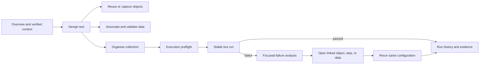

# SAP S/4HANA Test Automation Studio — User Journeys

## Method

These journeys were traced through React event handlers, API calls, Express routes, CLI integration, and regression tests. Interaction counts are approximate “major interactions” (decisions or action groups), not raw clicks or keystrokes. Static code tracing is verified; visual behaviour and live SAP outcomes are not.

## Journey 1 — Enter the application

- **Starting point:** User opens the locally hosted root URL.
- **User goal:** Confirm they are in the correct tool and decide what work to do.
- **Required decisions:** Choose one of seven areas; optionally interpret the selected environment and system status.
- **Major interactions:** 1–2.
- **Page transitions:** Browser load → Automation Overview; subsequent navigation is an in-memory view swap.
- **Potential confusion:** Three parallel navigation systems (sidebar, overview cards, and workflow footer/pipeline) imply that every task belongs to a fixed six-stage process. The displayed SAP connection and environment are not verified by backend state.
- **Missing feedback:** No startup health check, authenticated identity, workspace/project context, data-source freshness, or clear offline/degraded state.
- **Opportunities for simplification:** Present one primary navigation model and a role-aware “continue work” area; move process guidance into contextual onboarding.
- **Risk of user error:** **High** — a user can trust a false target/connection indicator before executing a test.
- **Recommended target journey:** Open `/overview` → shell verifies Studio API/capture-agent/execution target → display current workspace, environment, role, and recent work → choose a task from stable navigation.

## Journey 2 — Understand current project or workspace context

- **Starting point:** Any current screen.
- **User goal:** Know which project, test repository, SAP environment, and identity are active.
- **Required decisions:** None supported beyond choosing a decorative environment value.
- **Major interactions:** Not currently achievable.
- **Page transitions:** None.
- **Potential confusion:** The environment selector appears authoritative but changes local React state only. Files and databases are implicitly taken from one repository root. There is no project/workspace name or repository path in the UI.
- **Missing feedback:** No source-of-truth context, environment verification, tenant safety classification, credential profile, branch/version, or capture-session relationship.
- **Opportunities for simplification:** Introduce a persistent context bar backed by server capabilities; keep project and target selection distinct.
- **Risk of user error:** **Critical** — real business documents may be created in an unintended system.
- **Recommended target journey:** Shell loads context from server → shows workspace and environment badge with DEV/QA/PROD safety level → user can inspect details → execution uses the same context or blocks on mismatch.

## Journey 3 — Create a Test

- **Starting point:** Overview “Compose Test Case” or Test Step Composer navigation.
- **User goal:** Create a named test artifact ready for step authoring.
- **Required decisions:** File name, display name, process area/domain.
- **Major interactions:** 4 before adding steps; 6–8 including first save.
- **Page transitions:** Overview → Composer; no stable URL for the new test.
- **Potential confusion:** File name and test name are separate but their relationship is unexplained. Choosing a process template only displays “Template Active”; it does not populate steps. “App ID default” is inferred later from existing steps.
- **Missing feedback:** No duplicate-name check before save, naming guidance, required-field indicators, create success announcement, or explicit unsaved state immediately after creation (`dirty` starts false).
- **Opportunities for simplification:** Use a focused creation dialog with name, process area, optional template, and target application; generate the technical file identifier.
- **Risk of user error:** **High** — users may believe a template has created a runnable test or navigate away from an unsaved new file without warning.
- **Recommended target journey:** Tests list → New test → choose blank/template → enter Test name/process area/application → create draft with stable route → guided first-step empty state → save/publish status.

## Journey 4 — Add or edit test steps

- **Starting point:** An open Test in Composer.
- **User goal:** Define a clear, correctly ordered automation sequence.
- **Required decisions:** Module, App ID scope, object references, literal/data/handoff parameters, table-row structure, step order.
- **Major interactions:** 4–10 per step depending on module.
- **Page transitions:** None; editor expands inside the steps table.
- **Potential confusion:** Technical module names and parameter syntax are primary; required fields are marked but not enforced by the client; handoff hints appear only after a placeholder has already been entered; App ID inheritance is implicit.
- **Missing feedback:** No validation summary, step preview, runnable-readiness indicator, duplicate/missing-object check, or “test changed” announcement.
- **Opportunities for simplification:** Progressive module selection by user goal, schema-driven helper text, explicit value-source control (literal/data/output), and a persistent test outline.
- **Risk of user error:** **High** — malformed or unresolved parameters can be saved and fail only at execution.
- **Recommended target journey:** Add step → choose business action/module → confirm application/object → choose value source → validate inline → save step → keyboard-accessible reorder → test-level readiness summary.

## Journey 5 — Capture or select a UI5 object

- **Starting point:** UI Control Repository or an object parameter in Step Editor.
- **User goal:** Reuse a reliable existing object or capture a new stable control.
- **Required decisions:** Domain, App ID, target URL, scan vs interactive pick, object name/label/scope.
- **Major interactions:** Reuse: 3–5; new capture: 8–14 plus SAP navigation.
- **Page transitions:** Composer ↔ Objects through in-memory navigation; unsaved step context is lost when leaving.
- **Potential confusion:** Saved-object browsing, live session control, bulk capture, picking, curation, and raw inspection share one page. App IDs are manually typed. “Select now” depends on a separate visible browser and Ctrl+Click behaviour that is not explained in the primary control.
- **Missing feedback:** No capture-agent health, target-app mismatch warning, explicit pick instructions, save progress summary, duplicate-name prevention, or safe return to the originating step.
- **Opportunities for simplification:** Let object selection offer “Capture new” in context; use a guided capture session with clear stages and automatic return.
- **Risk of user error:** **High** — saving under the wrong App ID or choosing an unstable/incorrect control creates fragile tests.
- **Recommended target journey:** Object field → search existing compatible objects → preview/highlight → if absent, start capture → verify target and App ID → select control → name/validate → save → return value to the original step.

## Journey 6 — Associate test data

- **Starting point:** Test Data Matrix and a test step containing placeholders.
- **User goal:** Create reusable datasets and bind columns to step parameters.
- **Required decisions:** Dataset name, column names, row values, scalar/list/table mode, process area, placeholder mapping.
- **Major interactions:** 6–12 for initial dataset, plus editing per row.
- **Page transitions:** Composer → Data → Composer, relying on memory of parameter names.
- **Potential confusion:** There is no explicit binding view between a test and dataset. Glyph buttons switch cell modes without visible labels. Nested table data is serialized JSON inside CSV cells.
- **Missing feedback:** No schema comparison against placeholders, type validation, unused/missing-column warnings, dirty-state guard, import preview, or data sensitivity classification.
- **Opportunities for simplification:** Add a dataset schema view derived from selected tests; make value shape explicit and provide sample/validation.
- **Risk of user error:** **High** — misspelled headers and incompatible shapes fail at runtime; unsaved edits can be lost.
- **Recommended target journey:** From test → Associate data → select/create dataset → Studio derives expected variables → map or create columns → validate sample row → save association → show coverage/readiness.

## Journey 7 — Configure an execution

- **Starting point:** Execution Engine.
- **User goal:** Define exactly what runs, where, with which data and evidence options.
- **Required decisions:** Chain/Suite/Batch semantics, ordered members, App ID, data file, headless mode, evidence setting, target environment.
- **Major interactions:** 6–10.
- **Page transitions:** None.
- **Potential confusion:** Chain/Suite/Batch explanations are long paragraphs; Group/Process Suite terminology overlaps; the shell environment is disconnected; App ID has a hard-coded default; Batch hides App ID/data because they come from groups.
- **Missing feedback:** No preflight validation, estimated scope, selected data-row count, target/credential confirmation, duplicate member warning, or unresolved dependency check.
- **Opportunities for simplification:** Use a staged configuration summary with mode cards, reusable execution profiles, and preflight.
- **Risk of user error:** **Critical** — configuration can execute against a real SAP tenant and create documents without a final target summary.
- **Recommended target journey:** New execution → choose purpose/mode → select tests/suites → choose verified environment/profile → select data/options → run preflight → review exact impact → confirm and start.

## Journey 8 — Run a test

- **Starting point:** Completed execution configuration.
- **User goal:** Start one intended execution safely and receive an immutable run identifier.
- **Required decisions:** Final confirmation only.
- **Major interactions:** Currently 1; target 2 with risk-aware confirmation.
- **Page transitions:** Configuration and live output remain on the same screen.
- **Potential confusion:** Generic “Run” provides no final summary; no distinction between dry run, safe cleanup, and business-document creation.
- **Missing feedback:** No confirmation, idempotency protection, queued/accepted state, target verification, or notification if the user navigates away.
- **Opportunities for simplification:** Replace generic Run with “Review and run”, then show one concise confirmation.
- **Risk of user error:** **Critical** — accidental or duplicate execution can create real documents.
- **Recommended target journey:** Review and run → confirmation names target, tests, rows, and potential side effects → POST once with idempotency key → navigate to stable `/execute/runs/:id`.

## Journey 9 — Monitor execution progress

- **Starting point:** Run successfully accepted by the server.
- **User goal:** Understand current stage, elapsed time, progress, and whether intervention is required.
- **Required decisions:** Wait, navigate away, or eventually cancel if supported.
- **Major interactions:** 0–2.
- **Page transitions:** None; polling updates local state every two seconds.
- **Potential confusion:** “Waiting for the first step/group” can persist without indicating health. Completed results appear incrementally, but there is no overall progress model.
- **Missing feedback:** Current test/step, elapsed time, completed/total, last update, polling/network failure state, background notification, cancel, and safe navigation.
- **Opportunities for simplification:** Dedicated run monitor with summary header, progress timeline, and collapsible live details.
- **Risk of user error:** **High** — users may rerun a slow job, close a required visible browser, or mistake polling failure for execution failure.
- **Recommended target journey:** Stable run page → accepted/running state → live progress and connection freshness → optional cancel with consequence → completion notification and next actions.

## Journey 10 — Identify a failed step

- **Starting point:** Failed completion banner or result table.
- **User goal:** Find the first meaningful failure and its business/technical context.
- **Required decisions:** Choose failing group/test/step; determine whether failure is assertion, object, data, environment, or setup related.
- **Major interactions:** 2–5 plus vertical scanning.
- **Page transitions:** None.
- **Potential confusion:** Configuration remains above results; failures are embedded in several possible tables. Batch has group, stage, and step hierarchy but stage tables omit detailed step status unless a screenshot exists.
- **Missing feedback:** “Jump to first failure”, failure category, affected input, expected/actual value, step number, and related object/data links.
- **Opportunities for simplification:** Promote failure summary immediately below run header and collapse passing detail.
- **Risk of user error:** **High** — users may act on the raw tail log instead of the root failing step.
- **Recommended target journey:** Failed run opens focused summary → first failing test/step highlighted → expected/actual/error/screenshot together → drill into surrounding timeline.

## Journey 11 — Inspect screenshots, logs, and evidence

- **Starting point:** Failure detail in Execution or Audit Log.
- **User goal:** Collect enough evidence to understand and communicate the failure.
- **Required decisions:** Inspect screenshot, field evidence, log tail, or PDF.
- **Major interactions:** 2–6.
- **Page transitions:** Inline gallery or new browser tab for PDF.
- **Potential confusion:** Scratch report screenshots, permanent audit PDFs, captured values, field evidence, and log tail are presented as separate concepts. Audit history intentionally links only to PDF.
- **Missing feedback:** Screenshot timestamp/step metadata, zoom/download controls, sensitive-data warning/redaction, missing-artifact explanation, and relationship between temporary and archived evidence.
- **Opportunities for simplification:** One evidence viewer with metadata and explicit permanence, while keeping PDF as immutable export.
- **Risk of user error:** **Medium–High** — evidence may be shared without understanding sensitivity or whether it is the permanent record.
- **Recommended target journey:** Failure → evidence panel with step context → inspect/zoom/download permitted artifacts → open immutable PDF → copy a stable run link.

## Journey 12 — Correct the failure and rerun

- **Starting point:** Failed run detail.
- **User goal:** Navigate to the defective object, test step, or dataset, correct it, and rerun the same configuration.
- **Required decisions:** Root-cause category, artifact to edit, whether to rerun failed test or full scope.
- **Major interactions:** Currently 8–15 with manual reconstruction.
- **Page transitions:** Run → Objects/Composer/Data → Run; no links preserve artifact or run configuration.
- **Potential confusion:** The system does not connect a failure to the relevant editable artifact. Returning to Execution loses the previous configuration because `RunPanel` was unmounted.
- **Missing feedback:** Root-cause suggestions, deep links, “rerun with same configuration”, change summary, or comparison between attempts.
- **Opportunities for simplification:** Contextual fix links and immutable rerun lineage.
- **Risk of user error:** **High** — the wrong artifact may be edited or the rerun may use different configuration.
- **Recommended target journey:** Failure category → open linked object/step/data in context → save validated fix → return to run → rerun failed scope or full configuration → compare attempts.

## Journey 13 — Organise tests into chains, suites, or batches

- **Starting point:** Process Suites or Execution.
- **User goal:** Build reusable ordered business processes and independent packs.
- **Required decisions:** Whether to persist a Group or assemble an ad hoc Chain/Suite/Batch; order; App ID; data file.
- **Major interactions:** 6–12.
- **Page transitions:** Composer/Data may be visited to inspect member dependencies, then Groups/Execution.
- **Potential confusion:** “Process Suite” screen creates a `Group`; Execution separately offers Suite and Batch. The product brief’s precise semantics are represented mainly by long explanatory text.
- **Missing feedback:** Dependency graph, produced/consumed variables, duplicate members, member readiness, and group usage impact.
- **Opportunities for simplification:** Use a consistent artifact vocabulary and visual composition model.
- **Risk of user error:** **High** — selecting the wrong execution mode changes session isolation, data iteration, and stop-on-failure behaviour.
- **Recommended target journey:** Test Collections → New collection → choose dependent process or independent pack → add members with semantic explanation → validate dependencies/data → save → run from the collection.

## Journey 14 — Review reports and historical runs

- **Starting point:** Overview metric/captured feed, Audit & Evidence, or completion link.
- **User goal:** Find a run, understand outcome/trend, and obtain trustworthy evidence.
- **Required decisions:** Filter by App ID/status/date manually; choose evidence PDF.
- **Major interactions:** 3–7.
- **Page transitions:** Overview → Audit; evidence opens in new tab.
- **Potential confusion:** “Documents”, “Audit & Evidence”, and “Audit log” refer to overlapping but different concepts. Dashboard may display fabricated fallback records.
- **Missing feedback:** Search by test/suite/user/run ID/date, sortable columns, saved filters, trend analysis, run detail, comparison, and source-artifact links.
- **Opportunities for simplification:** Make Run History the primary concept; treat captured documents and evidence as facets of a run.
- **Risk of user error:** **High** for governance — sample data or incomplete filters can lead to incorrect reporting conclusions.
- **Recommended target journey:** Analyse → Runs → filter/search/sort → inspect stable run detail → open/download evidence → navigate to related test, environment, and captured documents.

## Journey 15 — Configure environments and application settings

- **Starting point:** Shell environment selector or expected Administration area.
- **User goal:** Configure SAP targets, credential profiles, safety classification, defaults, evidence policy, and capture-agent behaviour.
- **Required decisions:** Environment/profile and defaults.
- **Major interactions:** Not currently achievable in the web UI.
- **Page transitions:** None; no Settings route exists.
- **Potential confusion:** Three hard-coded environment options suggest configuration exists. Credentials are actually managed by CLI/OS store and the displayed selection is not passed to execution.
- **Missing feedback:** Authoritative environment list, connection test, masked identity, permission model, default run policy, retention settings, and administrative ownership.
- **Opportunities for simplification:** Add an Administration area backed by explicit server contracts; keep secrets out of browser storage.
- **Risk of user error:** **Critical** — target ambiguity can cause real SAP side effects; attempting to solve this in browser storage would create a security risk.
- **Recommended target journey:** Administration → Environments → configure non-secret metadata and credential-profile reference → test connection → classify target → save; shell displays verified active target and execution enforces it.

## Cross-journey target flow

## Highest-value journey changes

1. Make workspace and execution environment authoritative and visible.
2. Add preflight and confirmation before any run capable of SAP side effects.
3. Provide stable URLs for artifacts and runs.
4. Connect failure evidence directly to the relevant editable object, step, and data.
5. Preserve execution configuration for reruns and record parent/child run lineage.
6. Make object capture available from the composer without losing step context.
7. Validate dataset columns and handoff variables before execution.
8. Replace overlapping Group/Chain/Suite/Batch language with a consistent collection model plus explicit execution behaviour.
